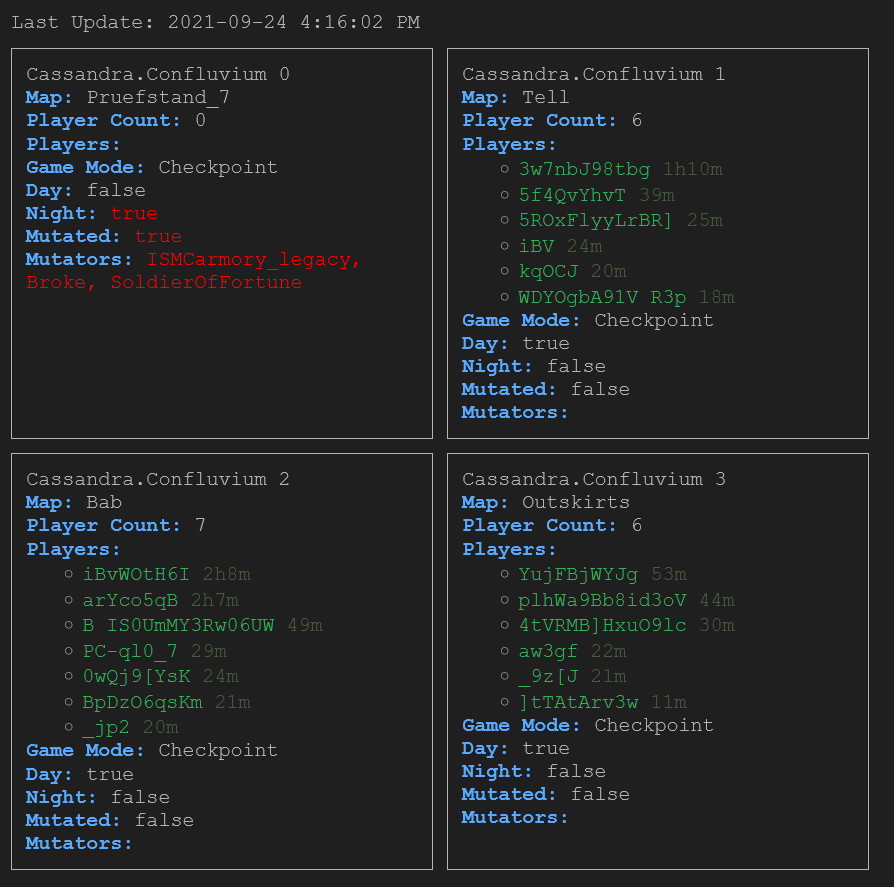

## About
Generate a web page and API that displays extra information about Cassandra Insurgency: Sandstorm servers. Ideally used to view when people are playing on a night map or with a mutation like shotguns only.



## Notes
If you want to access the API or website from another PC on your local network, you must connect via the host PC's internal IP address (e.g. 192.168.1.111:3000). Otherwise, use localhost:3000 if it's running on the same PC. I recommend installing on a Raspberry Pi for low power consumption (1 Watt).

## Installation

Nodemon required for caching API results:
```sh
npm i -g nodemon
```

Clone the repository:
```sh
https://github.com/heyjames/gamedig-cassandra.git
cd gamedig-cassandra
```

Install dependencies:
```sh
npm install
```

Start the web server:
```sh
nodemon
```

Web page/API routes:
```sh
http://localhost:3000
http://localhost:3000/api/server/0
http://localhost:3000/api/server/1
http://localhost:3000/api/server/2
http://localhost:3000/api/server/3
```
